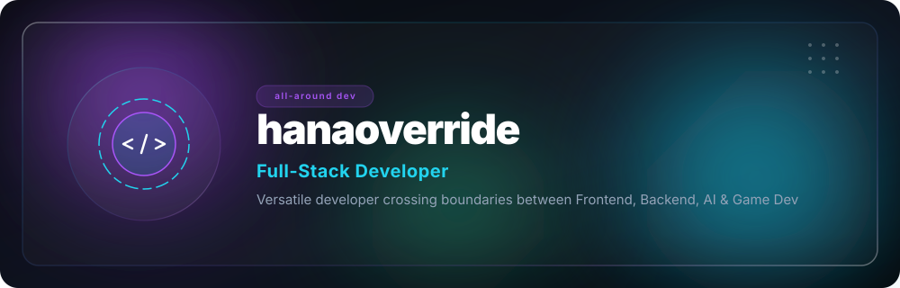
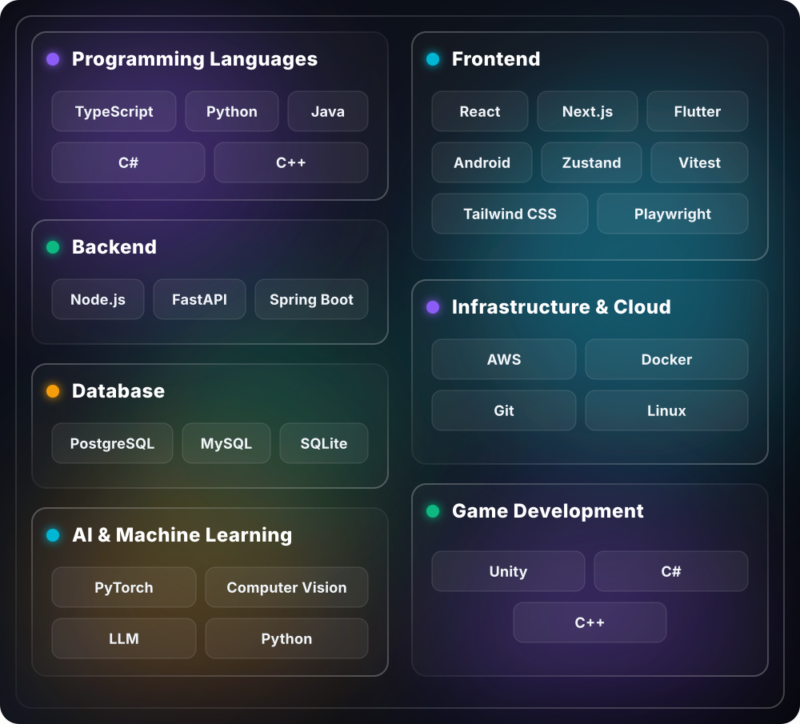

  <!-- Full Glassmorphic Liquid Glass Header -->
  

 

## 💫 About Me

I am a versatile **full-stack developer** who crosses boundaries between frontend, backend, AI, and game development. I flexibly combine the optimal tech stack to solve complex problems, aiming to create valuable experiences that go beyond simple implementation to deeply inspire users.

---

## 🛠️ Tech Stack Dashboard

  <!-- Custom Glassmorphic Tech Grid -->
  

---

## 🚀 Key Projects & Portfolio

### 🖥️ [Linux Desktop Portfolio](https://github.com/hanaoverride/mywebsite)
> **Interactive Linux Desktop GUI Portfolio Website**
>  
> `Next.js` `TypeScript` `Tailwind CSS` `Zustand` `Docker`

An interactive portfolio website crafted as a fully functional Linux desktop GUI. It embeds custom desktop applications like a simulated terminal, functional web browser, and mock mail client to deliver an engaging and unique experience.

---

### 🎨 [Landing Page Examples](https://landingpgex.netlify.app/)
> **High-End Motion & 3D Interactive Landing Pages**
>  
> `HTML/JS/CSS` `Tailwind CSS v4` `GSAP` `Three.js` `Playwright`

A premium collection of highly interactive landing page templates powered by GSAP animation engines and Three.js 3D layouts. Features four tailored aesthetic strategic frameworks: Corporate, Product showcase, Event campaign, and Creative Portfolio.

---

### 🧠 [Full-Stack RAG Web](https://github.com/hanaoverride/portfolio-rag-web)
> **Retrieval-Augmented Generation (RAG) Document Hub**
>  
> `Next.js` `FastAPI` `PostgreSQL` `LangChain` `OpenAI`

An enterprise-grade Full-Stack RAG web hub integrating LLM models with highly optimized vector databases. Enables intelligent document ingestion, semantic semantic search, and structural facts extraction from complex textual assets.

---

### 📄 [PDF OCR by LLM](https://github.com/hanaoverride/PDF-OCR-by-LLM)
> **AI-Corrected Image PDF Search Pipeline**
>  
> `Python` `EasyOCR` `OpenAI API` `PyMuPDF` `ReportLab`

An AI-augmented OCR correction pipeline that converts raw image PDFs into searchable digital files. It extracts text via EasyOCR, leverages LLMs to correct recognition errors based on context, and matches coordinates to stamp a hidden searchable text layer onto the original PDF.

---

## 📈 Dashboard Metrics

  

  

   
  2026 @hanaoverride

